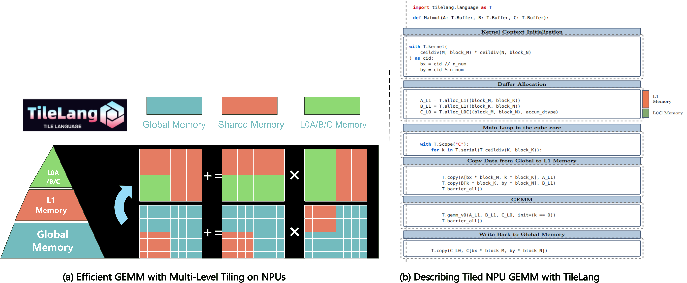

<div align="center">

# TileLang-Ascend


[](https://deepwiki.com/tile-ai/tilelang-ascend)

</div>

Tile Language Ascend (**tilelang-ascend**) is a specialized variant of the tile-lang domain-specific language, specifically optimized for Huawei Ascend NPU (Neural Processing Unit) architecture. Built upon the foundation of tile-lang's Pythonic syntax and [TVM](https://tvm.apache.org/) compiler infrastructure, tilelang-ascend enables developers to efficiently create high-performance AI compute kernels tailored for Ascend processors, including operations like GEMM, vector operations, and attention mechanisms. Tilelang-ascend allows developers to focus on productivity without sacrificing the low-level optimizations necessary for state-of-the-art performance on the NPU. The compiler backend supports two technical routes: [Ascend C & PTO](https://github.com/tile-ai/tilelang-ascend/tree/ascendc_pto) and [NPUIR](https://github.com/tile-ai/tilelang-ascend/tree/npuir).

<p align="center">
  

</p>

## Latest News
- 09/29/2025 🚀: We are excited to announce that tilelang-ascend, a dsl for high performance AI workloads on Ascend NPUs, is now open source and available to the public!

## Tested Devices
Although tilelang-ascend aims to be portable across a range of Ascend devices, it has been specifically tested and validated on the following NPUs: A2 and A3.

## OP Implementation Examples
**tilelang-ascend** provides the building blocks to implement a wide variety of operators on the NPU.
Some examples include:

- [Matrix Multiplication](./examples/gemm/)
- [Vector Add](./examples/elementwise/)
- [Flash Attention](./examples/flash_attention/)


Within the `examples` directory, you will also find additional complex kernels—such as [LightningIndexer](./examples/lightning_indexer/) and [SparseFlashAttention](./examples/sparse_flash_attention/), more operators will continuously be added.


## Installation

### Environment Preparation
We assume you already have an ascend environment with CANN and torch-npu installed. Firstly, set cann environment variables.

  ```bash
  source {your-cann-installed-path}/ascend-toolkit/set_env.sh
  ```

### TileLang-Ascend Installation

Here we use the method of compiling from source code for installation.

#### a) Download

    git clone --recursive https://github.com/tile-ai/tilelang-ascend.git
    cd tilelang-ascend

#### b) Compile and Install
    bash install_ascend.sh

#### c) Environment Variable Setup

    source set_env.sh

## Run


In this section, you will learn how to call NPU TileLang operators.

Here we use the **Matrix Multiplication** operator as an example for introduction.


```
cd examples/gemm
python example_gemm.py
```

Upon success, it will print:

```
Kernel Output Match!
```

## Comparison with NVIDIA Backend Implementation

GPUs primarily feature a three-level memory hierarchy that can be analogously mapped to NPU hardware architecture as follows:

**Memory Hierarchy Mapping:**
- `global memory` ↔ `global memory`
- `shared memory` ↔ `L1 buffer on cube core and unified buffer on vector core`  
- `register memory` ↔ `L0A/B/C buffer`

**Memory Management:**
TileLang-Ascend provides memory allocation primitives similar to the GPU version. For example, `alloc_{L1/ub/...}` functions allow on-chip memory allocation in a manner comparable to GPU programming.

**Execution Model Differences:**
At the execution level, NPUs lack thread-level abstractions. Therefore, we currently provide computation primitives operating at the `tile` granularity on vector cores. While the GPU version enables automatic parallelization of internal computations (e.g., addition) across different threads using `T.Parallel`, the NPU version requires manual vectorization through primitives like `T.add`.

**Cross-Core Communication:**
Additionally, since cube and vector cores on NPUs can only exchange data through global memory/L2 cache, the current implementation requires explicit specification of execution code for different cores using the `T.Scope` primitive. Synchronization between cores is managed through `T.set_cross_flag` and `T.wait_cross_flag`, and intermediate data transfer global tensors must be explicitly specified during kernel definition.


## Quick Start

In this section, you'll learn how to write and execute a straightforward GEMM (matrix multiplication) kernel using tilelang-ascend, The next chapter will introduce how to write a high-performance gemm kernel.

### GEMM Example with Annotations

Below is an example that demonstrates how to quickly implement a gemm on the ascend.

```python
@tilelang.jit(out_idx=[-1])
def matmul(M, N, K, block_M, block_N, K_L1, dtype="float16", accum_dtype="float"):

    # Calculate number of blocks in M and N dimensions
    m_num = M // block_M
    n_num = N // block_N

    @T.prim_func
    def main(
            A: T.Tensor((M, K), dtype),  # Input matrix A (M×K)
            B: T.Tensor((K, N), dtype),  # Input matrix B (K×N)
            C: T.Tensor((M, N), dtype),  # Output matrix C (M×N)
    ):

        with T.Kernel(m_num * n_num, is_npu=True) as (cid, _):

            bx = cid // n_num  # Block row index
            by = cid % n_num   # Block column index

            # Allocate L1 cache buffers for input matrices
            A_L1 = T.alloc_L1((block_M, K_L1), dtype)      # A block in L1
            B_L1 = T.alloc_L1((K_L1, block_N), dtype)      # B block in L1

            # Allocate L0C buffer for accumulation
            C_L0 = T.alloc_L0C((block_M, block_N), accum_dtype)

            # Core computation scope
            with T.Scope("C"):
                # Calculate number of K-dimension iterations
                loop_k = T.ceildiv(K, K_L1)

                # Iterate over K dimension blocks
                for k in T.serial(loop_k):
                    # Copy A and B blocks from global memory to L1 cache
                    T.copy(A[bx * block_M, k * K_L1], A_L1)
                    T.copy(B[k * K_L1, by * block_N], B_L1)

                    # Synchronize all cores before computation
                    T.barrier_all()

                    # Perform matrix multiplication
                    if k == 0:
                        # First iteration: initialize accumulator
                        T.gemm_v0(A_L1, B_L1, C_L0, init=True)
                    else:
                        # Subsequent iterations: accumulate results
                        T.gemm_v0(A_L1, B_L1, C_L0)

                    # Synchronize all cores after computation
                    T.barrier_all()

                # Copy final result from L0C to global memory
                T.copy(C_L0, C[bx * block_M, by * block_N])

    return main
```

### High Performance GEMM Example. (Layout, L2 Cache Swizzling, and Pipelining, etc.)

Below is an example that demonstrates more advanced features: layout annotation, parallelized copy, and swizzle for improved L2 cache locality. This snippet shows how to adapt your kernel to maximize performance on complex hardware.

```python
@tilelang.jit(out_idx=[-1])
def matmul(M, N, K, block_M, block_N, block_K, K_L1, S1, S2, dtype="float16", accum_dtype="float"):
    m_num = M // block_M
    n_num = N // block_N

    core_num = 20

    @T.macro
    def init_flag():
        T.set_flag("mte1", "mte2", 0)
        T.set_flag("mte1", "mte2", 1)
        T.set_flag("m", "mte1", 0)
        T.set_flag("m", "mte1", 1)
        T.set_flag("fix", "m", 0)

    @T.macro
    def clear_flag():
        T.wait_flag("mte1", "mte2", 0)
        T.wait_flag("mte1", "mte2", 1)
        T.wait_flag("m", "mte1", 0)
        T.wait_flag("m", "mte1", 1)
        T.wait_flag("fix", "m", 0)

    @T.prim_func
    def main(
            A: T.Tensor((M, K), dtype),
            B: T.Tensor((K, N), dtype),
            C: T.Tensor((M, N), dtype),
    ):
        with T.Kernel(core_num, is_npu=True) as (cid, _):
            A_L1 = T.alloc_L1((S1, block_M, K_L1), dtype)
            B_L1 = T.alloc_L1((S1, K_L1, block_N), dtype)

            T.annotate_layout({
                A_L1: make_zn_layout(A_L1),
                B_L1: make_zn_layout(B_L1),
            })

            A_L0 = T.alloc_L0A((S2, block_M, block_K), dtype)
            B_L0 = T.alloc_L0B((S2, block_K, block_N), dtype)
            C_L0 = T.alloc_L0C((block_M, block_N), accum_dtype)

            with T.Scope("C"):
                init_flag()

                for i in T.serial(T.ceildiv(m_num * n_num, core_num)):
                    T.use_swizzle(
                        i * core_num + cid, M, N, K, block_M, block_N, off=3, in_loop=True)
                    bx = cid // n_num
                    by = cid % n_num

                    loop_k = T.ceildiv(K, K_L1)

                    T.wait_flag("mte1", "mte2", 0)
                    T.copy(A[bx * block_M, 0], A_L1[0, :, :])
                    T.copy(B[0, by * block_N], B_L1[0, :, :])
                    T.set_flag("mte2", "mte1", 0)
                    T.wait_flag("fix", "m", 0)
                    for k in T.serial(loop_k):
                        if k < loop_k - 1:
                            T.wait_flag("mte1", "mte2", (k + 1) % S1)
                            T.copy(A[bx * block_M, (k + 1) * K_L1], A_L1[(k + 1) % S1, :, :])
                            T.copy(B[(k + 1) * K_L1, by * block_N], B_L1[(k + 1) % S1, :, :])
                            T.set_flag("mte2", "mte1", (k + 1) % S1)

                        loop_kk = T.ceildiv(K_L1, block_K)

                        for kk in T.serial(loop_kk):
                            if kk == 0:
                                T.wait_flag("mte2", "mte1", k % S1)
                            T.wait_flag("m", "mte1", kk % S2)
                            T.copy(A_L1[k % S1, 0, kk * block_K], A_L0[kk % S2, :, :])
                            T.copy(B_L1[k % S1, kk * block_K, 0], B_L0[kk % S2, :, :])
                            if kk == 3:
                                T.set_flag("mte1", "mte2", k % S1)
                            T.set_flag("mte1", "m", kk % S2)
                            T.wait_flag("mte1", "m", kk % S2)

                            if k == 0 and kk == 0:
                                T.mma(A_L0[kk % S2, :, :], B_L0[kk % S2, :, :], C_L0, init=True)
                            else:
                                T.mma(A_L0[kk % S2, :, :], B_L0[kk % S2, :, :], C_L0)

                            T.set_flag("m", "mte1", kk % S2)

                    T.set_flag("m", "fix", 0)
                    T.wait_flag("m", "fix", 0)
                    T.copy(C_L0, C[bx * block_M, by * block_N])
                    T.set_flag("fix", "m", 0)

                clear_flag()

                T.barrier_all()

    return main
```


### Dive Deep into TileLang Beyond GEMM

In addition to GEMM, we provide a variety of examples to showcase the versatility and power of TileLang-Ascend, including:

- [FlashAttention](./examples/flash_attention/): Implementations of FlashAttention with TileLang-Ascend.
- [LightningIndexer](./examples/lightning_indexer/): Implementations of LightningIndexer with TileLang-Ascend.
- [SparseFlashAttention](./examples/sparse_flash_attention/): Implementations of SparseFlashAttention with TileLang-Ascend.

## Upcoming Features

Check our [tilelang-ascend development plan](https://github.com/tile-ai/tilelang-ascend/issues/3) for upcoming features.


## Acknowledgements
We gratefully acknowledge the valuable support provided by Huawei's HiSilicon, ICT, Compiler and Programming Language Lab and the Peking University Kunpeng & Ascend Center for Excellence in Science, Education, and Innovation.